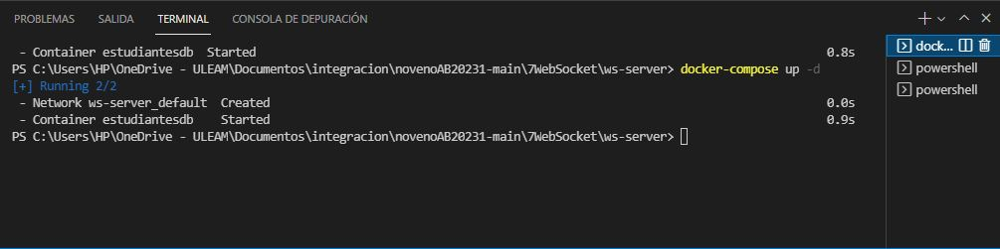
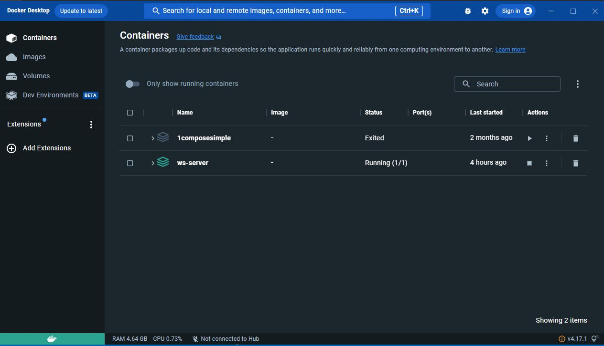
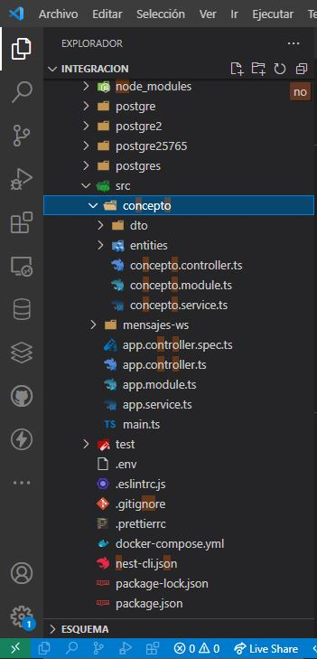
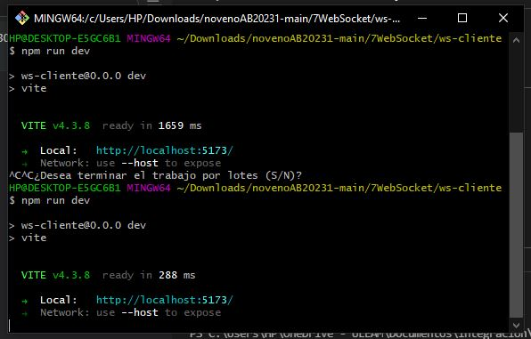
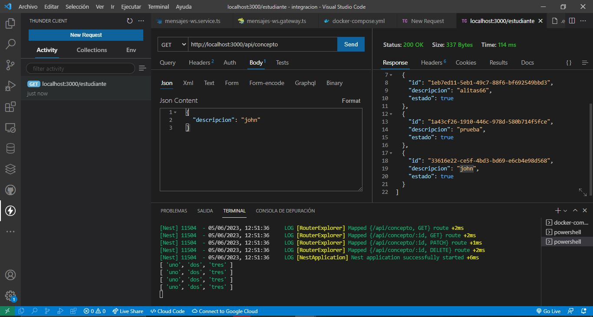
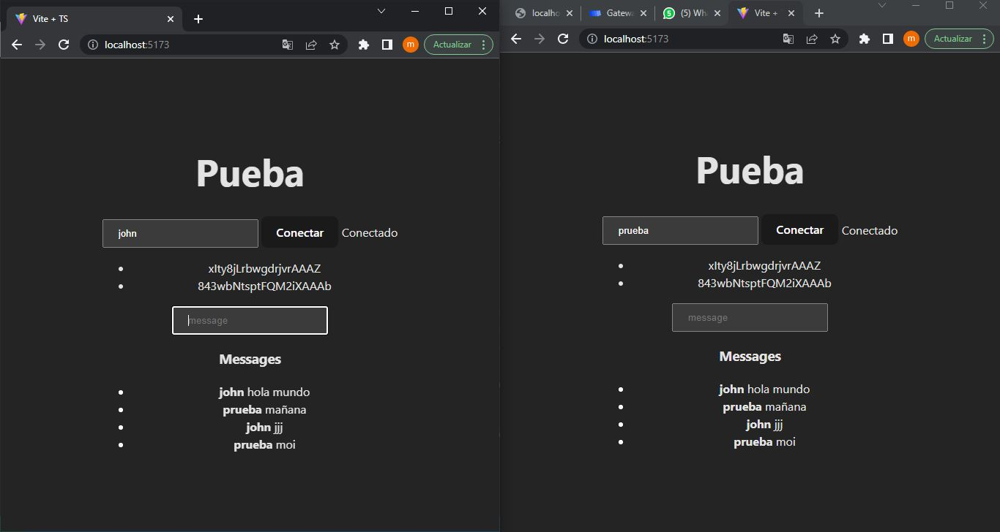

WEBSOCKET
NUMERO DE LISTA 2 ANCHUNDIA DELGADOLENIN MOISES
CONCEPTO, DESCRIPCION
METODOS GET REALIZADO 

IMAGENES PROBADAS Y FUNCIONANDO

EVIDENCIAS CAPTURAS DE IMAGENES
1. CREAMOS EL DOCKER

2.motramos en el docker que esta subido

3.

4. 

5. 

6. 

