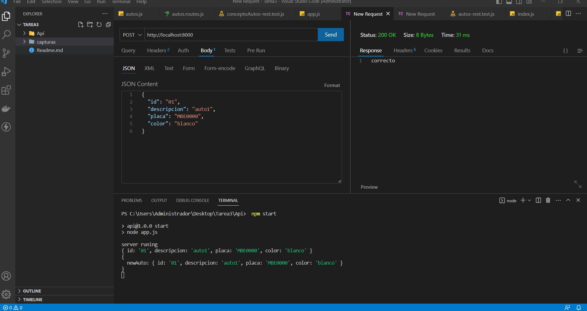
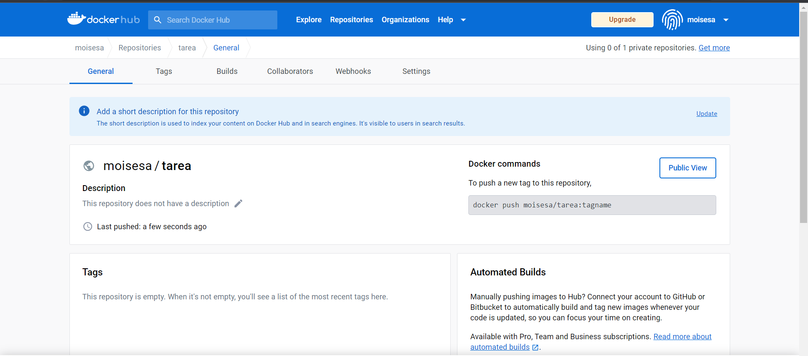
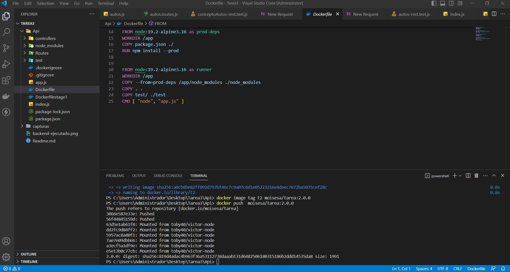
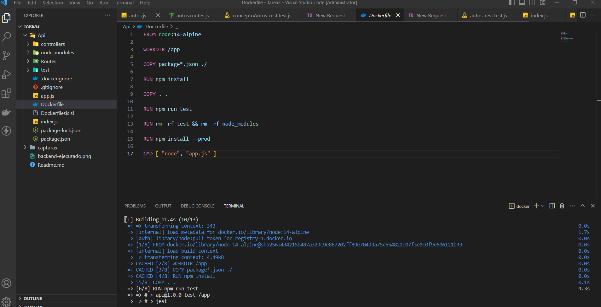
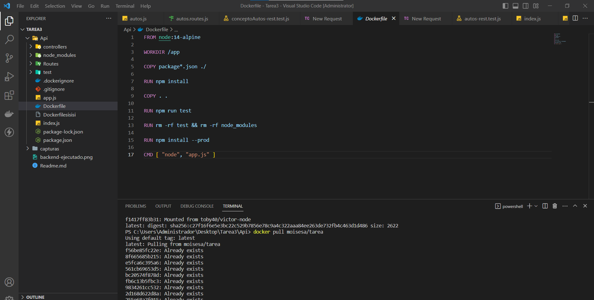
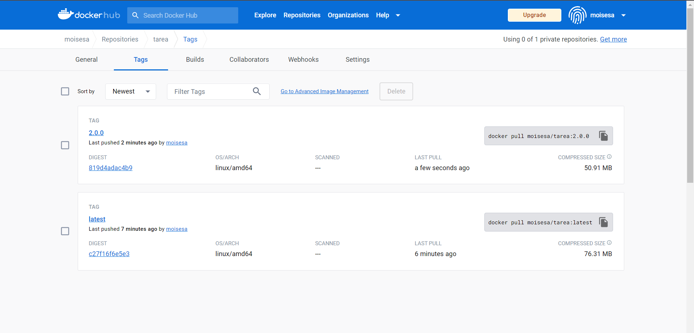

SERVICO REST JAVASCRIPT
NUMERO DE LISTA 2 LUCAS ANCHUNDIA LENIN MOISES
ENTIDADES: AUTOS, CONCEPTO_AUTOS
METODOS GET Y POST REALIZADOS CON ARRAYS
PRUEBAS UNITARIAS CON JEST 
DOCKER PRIMERA VERSION TAG MOISESA/TAREA
DOCKER SEGUNDA VERSION TAG MOISESA/TAREA:2.0.0
IMAGNES SUBIDAS EN DOCKER HUB
https://hub.docker.com/repository/docker/moisesa/tarea/general

IMAGENES PROBADAS Y FUNCIONANDO

EVIDENCIAS CAPTURAS DE IMAGENES
1. 

2.

3.

4. 

5. 

6. 

