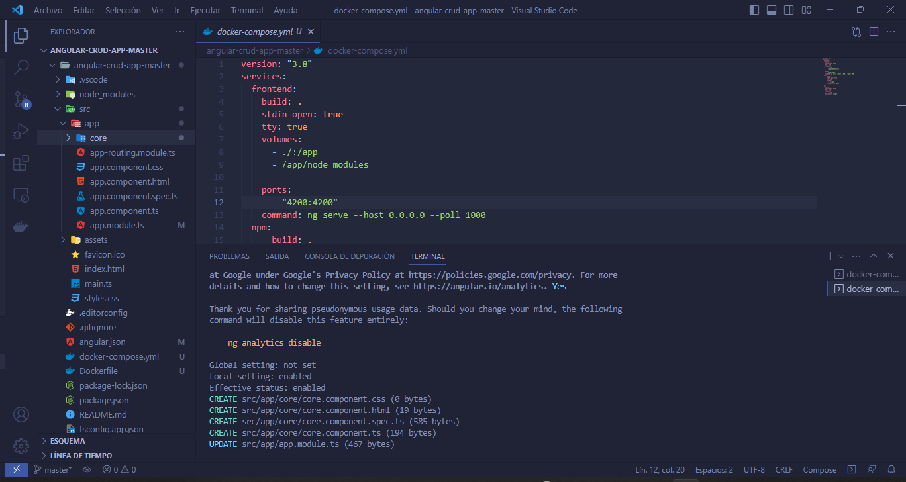
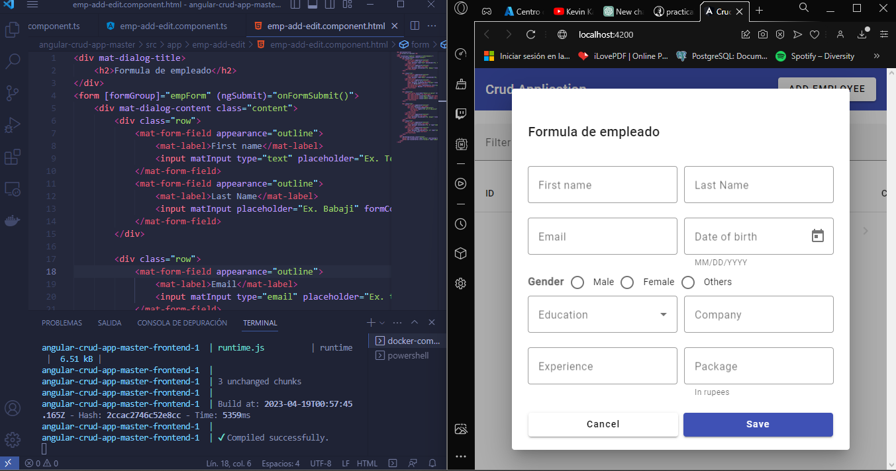
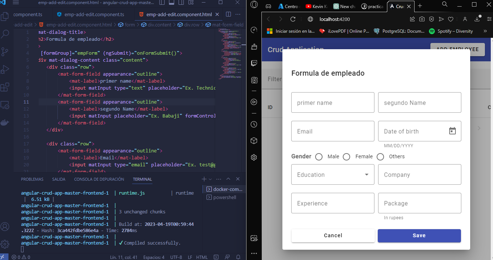

Funcionalidades 5

1. Primer comando Docker creacion de carpetas de ng

2. Segundo comando desde el cmd al Docker

3. Tercero comando desde el cmd al Docker

4. Cuarto comando desde el cmd al Docker

5. Comando desde el cmd al Docker

Cargar aplicación funcionando y permitir realizar cambios

1. 

2. 

